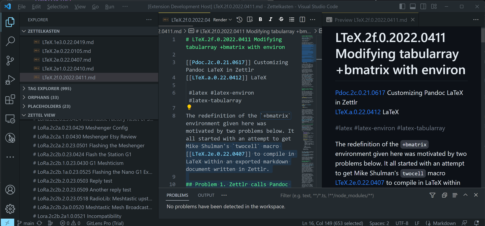

# Zettel View: a VS Code extension to list Zettels by H1 header

Zettel View is VStudio Code extension to display a list of markdown files by their H1 header. Zettel View and it contributes a Zettlr-like display of Zettels to the VS Code Explorer View, as shown below.

## VS Code API

This code uses following contribution points, activation events and APIs

### Contribution Points

- `views`

### Activation Events

- `onView:${viewId}`
- `onLanguage:markdown`

### APIs

- `window.createTreeView`
- `window.registerTreeDataProvider`
- `TreeView`
- `TreeDataProvider`
