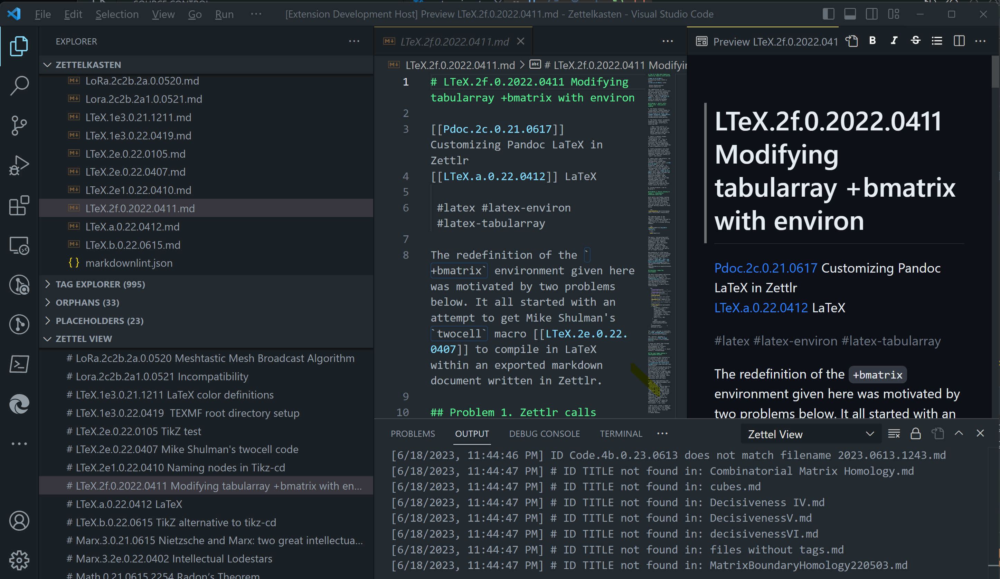

# Zettel View: a VS Code extension to list Zettels by H1 header

Zettel View is a Visual Studio Code extension to display a list of markdown files by their H1 header. Zettel View contributes a Zettlr-like display of Zettels to the VS Code Explorer View, as shown below.

Clicking on any file in the Zettel View window opens the Zettel markdown file in an editor window and causes the file explorer to highlight the selected file. Since I installed the "Auto-Open Markdown Preview" VS Code extension, the markdown preview of the selected Zettel also appears. The Zettel View output channel window displays informational messages about markdown files in the open folder.

Zettel View makes some assumptions about Zettels:
Zettels are markdown files with the extension `.md`.
A markdown file's H1 or level-one header has the form `# ID TITLE` (the `ID` is to the left; some prefer the `ID` on the right).
`ID` matches a regular expression for my `ID` scheme.
`ID.md` is the filename of the Zettel markdown file with the header `# ID TITLE`.

The second and third assumptions are hard-coded but could be made configurable in later versions of the extension. The extension does not enforce the fourth assumption: a mismatch between `ID.md` and the filename will appear as a discrepancy between the Zettel selected in the Zettel View, and the file explorer, and a message about the mismatch will appear in the Zettel View output channel window.

In the above screenshot, the Zettel View output channel window displays a notification that the ID `Code.4b.0.23.0610` (in the H1 header) does not match the filename `2023.0613.1243.md`. Other notifications name files that do not have an H1 header of the form `# ID TITLE`.

Zettr has the built-in configuration setting, "Display files using first heading level 1 if available." A community plugin for Obsidian called [File Explorer Markdown Titles](https://github.com/Dyldog/file-explorer-markdown-titles) once produced a similar display in the Obsidian file explorer. Unfortunately, that plugin no longer works with newer versions of Obsidian. Since VS Code is more valuable for my work than Obsidian, it made more sense to develop a VS Code extension than to modify the plugin to work with the current Obsidian API. I plan to move to VS Code the Pandoc and LaTeX integration I configured in Zettlr.

## Authors

Zettel View is a three-way collaboration between me, [@flengyel](https://github.com/flengyel), [ChatGPT-4](https://chat.openai.com), and [Bing Chat](https://www.bing.com/search?form=MA13FJ&q=Bing+AI&showconv=1). Some boilerplate code and resource files were borrowed (or leftover) from Microsoft's [Tree View](https://code.visualstudio.com/api/extension-guides/tree-view#extension-capabilities-articles) code [sample](https://github.com/microsoft/vscode-extension-samples/tree/main/tree-view-sample). Accordingly, the extension is released under an MIT license. The text is CC BY-SA 4.0.

## VS Code API

This code uses the following contribution points, activation events, and APIs

### Contribution Points

- `views`

### Activation Events

- `onLanguage:markdown`

### APIs

- `window.createTreeView`
- `window.registerTreeDataProvider`
- `TreeView`
- `TreeDataProvider`
